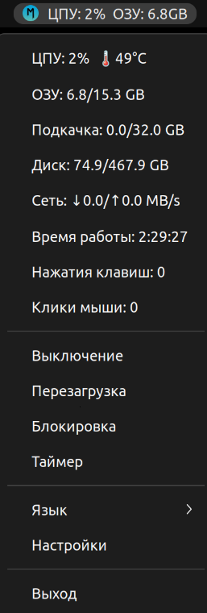
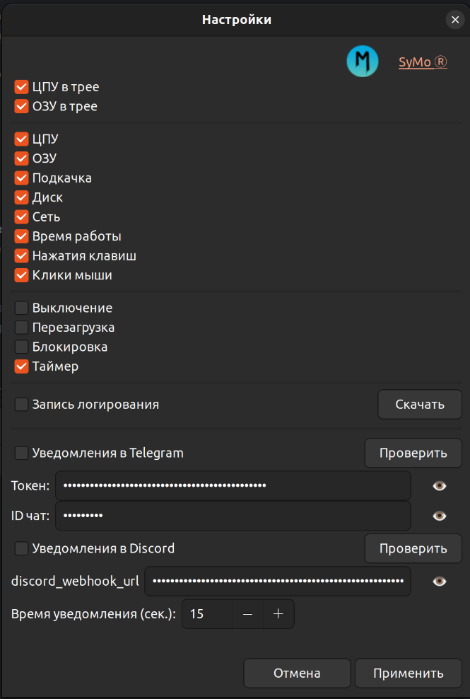

# SyMo Ⓡ
- 🇧🇾 Приложение SyMo для мониторинга системы и управления питанием с иконкой в трее. 🇧🇾 
---------------------------------------------------------------------------------

---------------------------------------------------------------------------------
# Основные функции
Системный монитор
- Реальное время отображения:
  - Загрузка CPU (с температурой)
  - Использование RAM и SWAP
  - Дисковое пространство
  - Скорость сети (входящий/исходящий трафик)
  - Время работы системы (uptime)
  - Счетчик нажатий клавиш и кликов мыши
- Настраиваемый интерфейс:
  - Выбор отображаемых параметров
  - Настройка отображения в трее
  - Отправка уведомлений в Telegram, по таймеру

Управление питанием
- Быстрые действия:
  - Выключение компьютера
  - Перезагрузка компьютера
  - Блокировка экрана компьютера
- Таймерные команды:
  - Отложенное выполнение действий
  - Уведомления перед выполнением

Доступные языки интерфейса:
- Русский
- Английский
- Китайский
- Немецкий
---------------------------------------------------------------------------------

---------------------------------------------------------------------------------
ДЕМО
- <p>Видео демонстрация</p>
[](https://www.youtube.com/watch?v=eNh-yalHPO0)

- <p>Трей приложения</p>


- <p>Меню настроек</p>


---------------------------------------------------------------------------------

---------------------------------------------------------------------------------
-  ЗАПУСК В РЕЖИМИ РАЗАРБОТКИ. 

💡 Установка apt для Debian/Ubuntu (основные библиотеки).
```bash
sudo apt update
sudo apt install python3-gi python3-gi-cairo gir1.2-gtk-3.0 gir1.2-appindicator3-0.1
sudo apt install -y build-essential libgirepository1.0-dev gir1.2-glib-2.0 python3-gi python3-gi-cairo gobject-introspection
```

💡 Если буду проблемы при запуске.
```bash
sudo apt update
sudo apt install python3.10-dev
sudo apt install pkg-config
sudo apt install libcairo2-dev
sudo apt install build-essential
sudo apt install gnome-shell-extension-appindicator
pip install pygobject
```

💡 Python-зависимости.
```bash
pip install -r requirements.txt
```

💡 Запуск.
```bash
python3 app.py
```
---------------------------------------------------------------------------------

---------------------------------------------------------------------------------
- СБОРКА ПРИЛОЖЕНИЯ

💡 Сборка приложения в пакет (файлы и папки). В файле "build_deb.sh" вся структура проекта для сборки приложения!
```bash
chmod +x build_deb.sh
./build_deb.sh
```

💡 Проверьте, что пакет создался
```bash
ls -l *.deb
```

💡 Установка собранного пакета после успешной сборки
```bash
#sudo apt install ./systray-monitor_1.0.0_all.deb
sudo dpkg -i SyMo_1.0.1_all.deb
```

💡 Удалить пакет (рекомендуемый способ)
```bash
sudo apt remove symo
```

💡 Удалить пакет вместе с конфигурационными файлами
```bash
sudo apt purge SyMo
```

💡 Убедится, что пакет удален 
```bash
which SyMo
dpkg -l | grep SyMo
```
---------------------------------------------------------------------------------

---------------------------------------------------------------------------------
- ОБРАТНАЯ СВЯЗЬ

- Почта: olegpustovalov220@gmail.com 
- Телеграмм: @OlegEgoism

