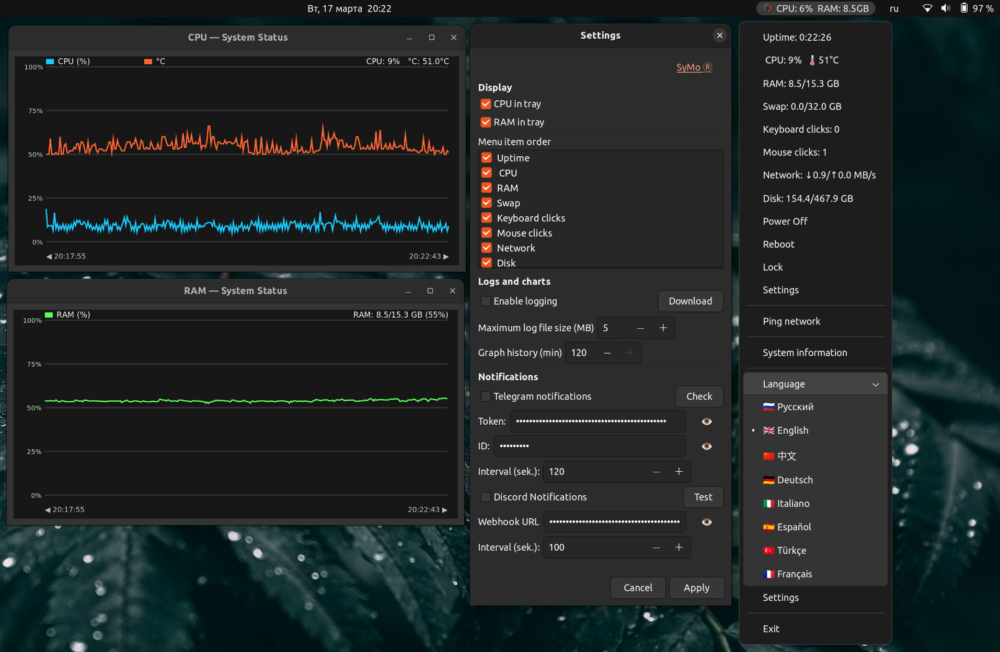

<h1>
"SyMo" Application
</h1>


<h2 style="color: chocolate">
Application Description and Features
</h2> 

<h3> 
SyMo is a GTK-based system tray utility that surfaces real-time system metrics, manages power actions, and delivers optional Telegram/Discord notifications. 
It is designed to run on Linux desktops with AppIndicator/Ayatana support, displaying compact tray labels while exposing richer details through the indicator menu.
</h3>

Made By ❤ [OlegEgoism](https://github.com/OlegEgoism)

<h3>Repository Structure (actual)</h3>

The SyMo repository is now grouped so core application logic lives under one folder (`app_core/`),
while documentation and external notification adapters remain in dedicated top-level directories.

```
SyMo/
├─ app_core/               # core application package
│  ├─ __init__.py
│  ├─ app.py               # SystemTrayApp runtime, menu wiring, periodic updates
│  ├─ dialogs.py           # GTK settings dialog; log export, reset counters, notification settings
│  ├─ power_control.py     # power actions + confirmation/scheduling dialogs
│  ├─ system_usage.py      # psutil-based system metrics (temp, CPU, RAM/SWAP, disk, network, uptime)
│  ├─ click_tracker.py     # thread-safe keyboard/mouse counters
│  ├─ constants.py         # app constants, paths, defaults, language list
│  ├─ localization.py      # translation helpers and language selection
│  ├─ language.py          # localized string dictionaries
│  └─ logging_utils.py     # log rotation utilities
│
├─ notifications/
│  ├─ __init__.py          # convenience exports
│  ├─ telegram.py          # Telegram notifier config, polling, command handling
│  └─ discord.py           # Discord webhook notifier config + send logic
│
├─ tests/                  # pytest suites
│  ├─ test_system_info_localization.py      # localization integrity for System Info labels
│  ├─ test_system_info_visibility_setting.py # settings wiring for show/hide System Info tray item
│  └─ test_build_artifacts_bundle.py         # build/uninstall scripts expectations
├─ app.py                  # thin launcher for app_core.app
├─ build.sh                # Nuitka build helper; collects artifacts into SyMo-bundle/
├─ uninstall-symo.sh       # uninstall helper (desktop files, autostart, binaries, local artifacts)
├─ SyMo-bundle/            # (generated) unified build artifacts directory
├─ requirements.txt        # Python dependencies
├─ logo.png, img.png       # branding and README visuals
└─ README.md               # quickstart and usage overview
```

<h3>Technical Deep Dive</h3>

<h3>System Monitor</h3>

- Real-time display:
    - CPU load with temperature.
    - RAM and SWAP usage.
    - Disk space.
    - Network speed (incoming/outgoing traffic).
    - System uptime.
    - Keyboard presses and mouse clicks counter.
- Customizable interface:
    - Select display parameters.
    - Tray display settings.
    - Send notifications to Telegram and Discord on timer.
- System info dialog from tray:
    - Menu item **"System information / Характеристики ПК"**.
    - Shows key machine details (OS, host, architecture, CPU model/cores/threads/frequency, RAM total).
    - Visibility of this tray item can be toggled in **Settings** (option: show/hide System info).

<h3>Power Management</h3>

- Quick actions:
    - Shut down computer.
    - Restart computer.
    - Lock computer screen.
- Timer commands:
    - Delayed action execution.
    - Notifications before execution.

<h3>Available Interface Languages</h3>

- 🇷🇺 Russian.
- 🇬🇧 English.
- 🇨🇳 Chinese.
- 🇩🇪 German.
- 🇮🇹 Italian.
- 🇪🇸 Spanish.
- 🇹🇷 Turkish.
- 🇫🇷 French.

<h3>Feedback and Support</h3>

- Email: olegpustovalov220@gmail.com
- Developers: https://github.com/OlegEgoism



<h3>Video Demonstration</h3>

[](https://www.youtube.com/watch?v=eNh-yalHPO0)

<h2 style="color: chocolate">
Telegram and Discord Integration
</h2>

<h3>Telegram Instructions</h3>

To create and get information about "Token": https://web.telegram.org/k/#@BotFather

To get "Chat ID": https://web.telegram.org/k/#@getmyid_bot

<h3>Discord Instructions</h3>

- Open Discord → select your server.
- Go to Server Settings → Integrations → Webhooks.
- Click "Create Webhook".

<h2 style="color: chocolate">
Running in Development Mode
</h2>

<h3>💡 apt Installation for Debian/Ubuntu (core libraries)</h3>

```bash
sudo apt update
sudo apt install python3-gi python3-gi-cairo gir1.2-gtk-3.0 gir1.2-appindicator3-0.1
sudo apt install -y build-essential libgirepository1.0-dev gir1.2-glib-2.0 python3-gi python3-gi-cairo gobject-introspection
```

<h3>💡 If there are problems with startup</h3>

```bash
sudo apt update
sudo apt install python3.10-dev
sudo apt install pkg-config
sudo apt install libcairo2-dev
sudo apt install build-essential
sudo apt install gnome-shell-extension-appindicator
pip install pygobject
```

<h3>💡 Python-dependencies</h3>

```bash
pip install -r requirements.txt
```

<h3>💡 Launching the application</h3>

`app.py` is a lightweight launcher, while the main runtime is in `app_core/app.py`.

```bash
python3 app.py
```

<h2 style="color: chocolate">
    Building app
    <span style="color: red">(recommended)</span>
</h2>

<h3>💡 Launch file "build.sh" (assembly time up to 5 minutes)</h3>

```bash
chmod +x build.sh
./build.sh
```

<h3>💡 Build output location</h3>

After running `build.sh`, all generated artifacts are collected into a single folder:

```bash
ls -la SyMo-bundle
```

Expected artifacts in `SyMo-bundle/`:

- `app.build`
- `app.dist`
- `app.onefile-build`
- `build_standalone`
- `SyMo-standalone`
- `SyMo-onefile`
- `SyMo-launch`
- `SyMo-run`

<h3>💡 Build a single installer file (`.run`)</h3>

This repository also includes a self-extracting installer builder script based on `makeself`.

```bash
sudo apt update
sudo apt install -y makeself
chmod +x scripts/build-installer.sh
./scripts/build-installer.sh
```

After that, you will get `SyMo-installer.run`.
The user can install with:

```bash
chmod +x SyMo-installer.run
./SyMo-installer.run
```

<h3>💡 Bundle archive for distribution</h3>

```bash
tar -czf SyMo-bundle.tar.gz SyMo-bundle/
```

<h2 style="color: chocolate">
  Remove
  <span style="color: red">(recommended)</span>
</h2>

```bash
chmod +x uninstall-symo.sh
./uninstall-symo.sh
```

`uninstall-symo.sh` also removes local build artifacts, including `SyMo-bundle/`.
