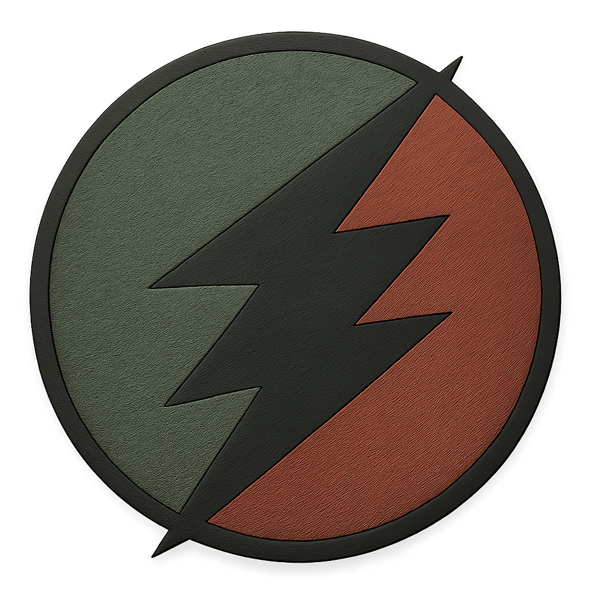
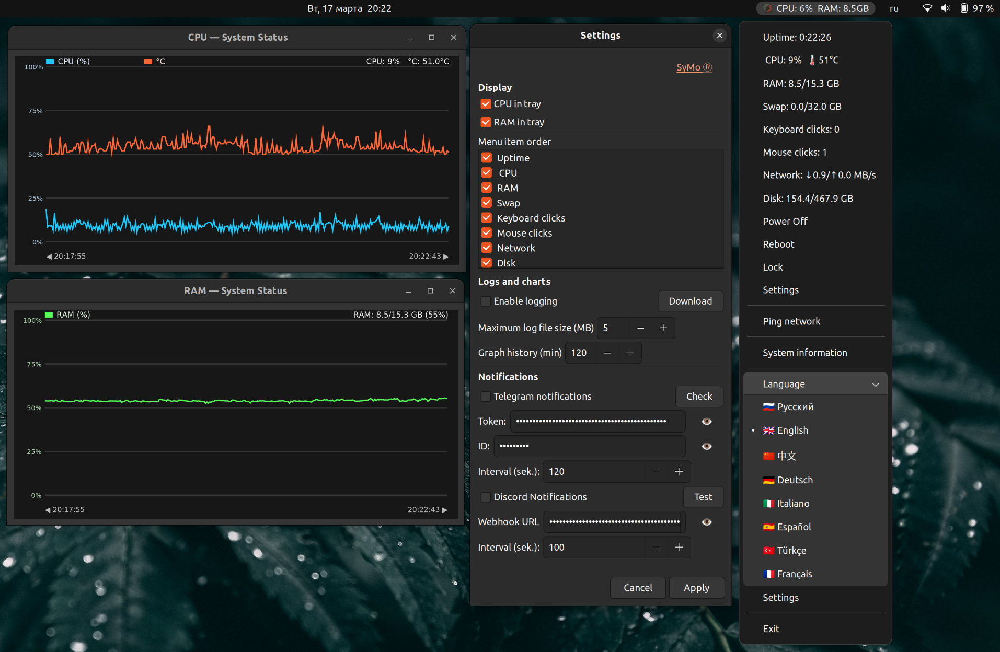

# SyMo ([EN](README.md))



SyMo — это лёгкое GTK-приложение для Linux-трея: показывает системные метрики и отправляет уведомления в Telegram/Discord.

## Минимальное описание проекта

- Мониторинг в трее (CPU/RAM/Swap/Disk/Network/Uptime).
- Быстрые действия: выключение, перезагрузка, блокировка, таймер.
- Уведомления через Discord, Telegram.

## Возможности

- Мониторинг системы в реальном времени:
    - загрузка и температура CPU;
    - использование RAM и swap;
    - использование диска;
    - скорость сети (скачивание/загрузка);
    - аптайм;
    - счётчики активности клавиатуры и мыши.
- Настраиваемое меню в трее:
    - показывать/скрывать пункты меню;
    - изменять порядок пунктов меню перетаскиванием в Настройках.
- Отдельные окна графиков по каждой метрике (CPU, RAM, Swap, Disk, Network, Keyboard, Mouse).
  - Интерактивное управление в окнах графиков:
    - колесо мыши: масштабирование по горизонтали;
    - зажатая левая кнопка мыши + движение: горизонтальное перемещение графика;
    - наведение курсора: подсказка рядом с мышью с временем и значениями ближайшей точки.
- Управление питанием:
    - выключение;
    - перезагрузка;
    - блокировка экрана;
    - отложенное выполнение с планировщиком/таймером.
- Уведомления:
    - интеграция с Telegram-ботом;
    - интеграция с Discord webhook.
  - Команды Telegram-бота:
    - `/status` — текущий статус системы;
    - `/screenshot` — сделать скриншот экрана и отправить в Telegram.
- Многоязычный интерфейс.

## Поддерживаемые языки интерфейса

- 🇷🇺 Русский (`ru`)
- 🇬🇧 Английский (`en`)
- 🇨🇳 Китайский (`cn`)
- 🇩🇪 Немецкий (`de`)
- 🇮🇹 Итальянский (`it`)
- 🇪🇸 Испанский (`es`)
- 🇹🇷 Турецкий (`tr`)
- 🇫🇷 Французский (`fr`)

## Структура репозитория

```text
SyMo/
├─ app.py                    # тонкий launcher
├─ app_core/                 # основная логика приложения
│  ├─ app.py                 # runtime: трей, меню, цикл обновления, завершение
│  ├─ graphs.py              # описания графиков + единое окно GraphWindow
│  ├─ graph_math.py          # зум, панорамирование, прореживание (без GTK)
│  ├─ history.py             # потокобезопасная история метрик для графиков
│  ├─ settings.py            # настройки по умолчанию, нормализация, атомарная запись JSON
│  ├─ dialogs.py             # диалог настроек
│  ├─ power_control.py       # команды питания и планировщик
│  ├─ system_usage.py        # сбор системных метрик + MetricsSnapshot
│  ├─ click_tracker.py       # счётчики клавиатуры/мыши
│  ├─ localization.py        # i18n-утилиты
│  ├─ language.py            # словари переводов
│  ├─ constants.py           # константы и пути config/log
│  ├─ ui.py                  # общие GTK-помощники
│  └─ logging_utils.py       # настройка logging и запись лога метрик
├─ notifications/
│  ├─ base.py                # повторы запросов, формат статуса, фоновая отправка
│  ├─ telegram.py            # уведомления Telegram + опрос команд
│  └─ discord.py             # уведомления Discord webhook
├─ gnome_extension/          # расширение SyMo Launcher для GNOME Shell
│  ├─ gnome-42-44/           # старый формат (Ubuntu 22.04)
│  └─ gnome-45/              # ES-модули (Ubuntu 24.04 и новее)
├─ build.sh                  # сборка релиза: .deb, архив приложения, архивы расширения
├─ build-deb.sh              # сборка пакета .deb из результата build.sh
├─ install.sh                # установщик, входит в архив релиза
├─ uninstall-symo.sh         # удаление SyMo (--purge удаляет и настройки)
├─ package-gnome-extension.sh
├─ requirements.txt          # зависимости приложения
├─ requirements-build.txt    # зависимости сборки (Nuitka)
├─ LICENSE                   # GPL-2.0
├─ logo.png
├─ img.png
└─ README.md
```

## Поддерживаемые системы

| Ubuntu | GNOME Shell | Python |
|---|---|---|
| 22.04 LTS | 42 | 3.10 |
| 24.04 LTS | 46 | 3.12 |
| 24.10 / 25.04 / 25.10 / 26.04 | 47 / 48 / 49 / 50 | 3.12+ |

Для значка в трее нужна поддержка AppIndicator. В Ubuntu она есть по умолчанию
(расширение «Ubuntu AppIndicators»); в «чистом» GNOME установите
`gnome-shell-extension-appindicator`.

## Установка (пакет .deb, рекомендуется)

Скачайте `symo_<версия>_amd64.deb` из GitHub Releases и откройте его в «Центре
приложений» Ubuntu или выполните:

```bash
sudo apt install ./symo_*_amd64.deb
```

Один пакет ставит всё: приложение, команду `symo`, ярлык в меню и автозапуск при входе
для всех пользователей; нужные библиотеки GTK и AppIndicator apt установит сам.
Запустите SyMo из меню приложений сразу после установки — дальше он будет стартовать
при каждом входе. Отключить автозапуск можно в «Автоматически запускаемых приложениях».

Удаление:

```bash
sudo apt remove symo
```

## Установка (архив релиза)

Без прав администратора скачайте `SyMo-<версия>-linux-x86_64.tar.gz` из GitHub Releases и выполните:

```bash
sudo apt install gir1.2-gtk-3.0 gir1.2-ayatanaappindicator3-0.1
tar xzf SyMo-*-linux-x86_64.tar.gz
./SyMo-*-linux-x86_64/install.sh
```

Приложение устанавливается в `~/.local/opt/SyMo`, появляется в меню приложений,
доступно командой `symo` и запускается при входе в систему (`--no-autostart`
отключает автозапуск).

Дополнительные утилиты для команды Telegram `/screenshot`:

```bash
sudo apt install gnome-screenshot scrot grim imagemagick
```

### Расширение GNOME Shell

[](https://extensions.gnome.org/extension/9526/symo-launcher/)

[SyMo Launcher](https://extensions.gnome.org/extension/9526/symo-launcher/) добавляет
на панель кнопку с пунктами **Open SyMo** и **Project page**. Сначала установите само
приложение SyMo (см. выше): extensions.gnome.org не разрешает расширениям содержать
программы.

Кнопка видна, только пока SyMo не запущен. Как только SyMo стартует, на панели
остаётся лишь его собственный значок; когда SyMo закрывают, кнопка возвращается.

| GNOME Shell | Ubuntu | Архив расширения |
|---|---|---|
| 42–44 | 22.04 | `symo-launcher-gnome-42-44.shell-extension.zip` |
| 45–50 | 24.04, 24.10, 25.04, 25.10, 26.04 | `symo-launcher-gnome-45.shell-extension.zip` |

Узнать свою версию: `gnome-shell --version`.

**Приложение «Менеджер расширений»** (проще всего):

```bash
sudo apt install gnome-shell-extension-manager
```

Откройте «Менеджер расширений» → «Просмотр» → найдите **SyMo Launcher** → «Установить».

**Через браузер:** установите мост для браузера (`chrome-gnome-shell` в Ubuntu 22.04,
`gnome-browser-connector` в 24.04 и новее) и дополнение *GNOME Shell integration*
для Firefox или Chrome, затем откройте
[страницу расширения](https://extensions.gnome.org/extension/9526/symo-launcher/) и
включите переключатель.

**Вручную:** если сайт показывает *INCOMPATIBLE* для вашей версии GNOME, скачайте
подходящий архив из GitHub Releases и выполните:

```bash
gnome-extensions install --force symo-launcher-gnome-*.shell-extension.zip
```

Выйдите из системы и войдите снова (обязательно в сеансе Wayland), затем включите
расширение:

```bash
gnome-extensions enable symo@olegegoism.github.io
```

## Удаление

Для пакета `.deb`: `sudo apt remove symo`. Для архива релиза:

```bash
~/.local/opt/SyMo/uninstall-symo.sh           # настройки и токены сохраняются
~/.local/opt/SyMo/uninstall-symo.sh --purge   # удалить всё
```

## Запуск из исходников

```bash
sudo apt install python3-venv python3-gi python3-gi-cairo gir1.2-gtk-3.0 \
  gir1.2-ayatanaappindicator3-0.1
python3 -m venv --system-site-packages .venv
.venv/bin/pip install -r requirements.txt
.venv/bin/python app.py
```

`--system-site-packages` берёт PyGObject и pycairo из apt: ничего не нужно
компилировать, и шаги одинаковы для всех поддерживаемых версий Ubuntu.

## Сборка релиза

Собирайте на Ubuntu 22.04: бинарник зависит от glibc и работает на этой версии
и на всех более новых.

```bash
sudo apt install build-essential patchelf
.venv/bin/pip install -r requirements-build.txt
./build.sh
```

Результат в `dist/`:

- `symo_<версия>_amd64.deb` — основной файл для скачивания, прикрепить к релизу на GitHub;
- `SyMo-<версия>-linux-<arch>.tar.gz` и `.sha256` — прикрепить к релизу на GitHub;
- `symo-launcher-gnome-42-44.shell-extension.zip` и
  `symo-launcher-gnome-45.shell-extension.zip` — загрузить оба на
  extensions.gnome.org как отдельные версии одного расширения и прикрепить к
  релизу на GitHub для ручной установки.

Версия приложения задаётся в `app_core/constants.py` (`APP_VERSION`), версия
расширения — `version-name` в `gnome_extension/*/metadata.json`.

## Лицензия

Copyright © 2025–2026 OlegEgoism.

SyMo и расширение SyMo Launcher — свободное ПО, распространяется по лицензии
GNU General Public License версии 2.0 или более поздней (GPL-2.0-or-later). См. [LICENSE](LICENSE).

## Контакты

- Автор: [OlegEgoism](https://github.com/OlegEgoism)
- Репозиторий: <https://github.com/OlegEgoism/SyMo>
- Telegram: [@OlegEgoism](https://t.me/OlegEgoism)
- Email: olegpustovalov220@gmail.com



## Видео на YouTube:

[](https://youtube.com/shorts/X1tlQ4XuLSM?feature=share)
[](https://youtu.be/zvdoo9JA88k)
